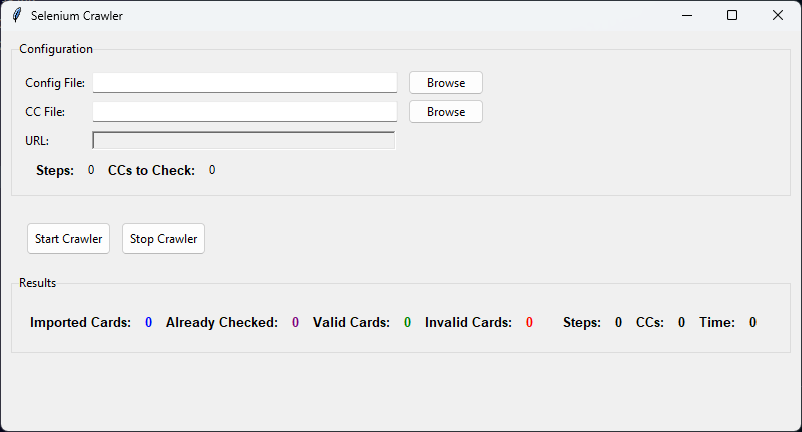

# Dynamic Selenium Crawler Guide

## [English]

This guide will help you understand how to use the dynamic Selenium Crawler for automating website interactions. This tool leverages JSON configuration files, providing exceptional flexibility and adaptability for various web automation tasks.

### Introduction

The Dynamic Selenium Crawler is engineered to automate repetitive web tasks such as form filling, button clicking, and page navigation. It operates based on a sequence of actions defined within a JSON configuration file. The key advantages include:

*   **High Flexibility:** Easily adapt the crawler to different websites by simply modifying the `config.json` file. No code changes are usually needed.
*   **Maintainable Design:** The crawler is built with a modular and object-oriented architecture, making it easy to understand, extend, and maintain.
*   **Efficient Automation:** Automate repetitive and time-consuming web interactions, saving time and effort.
*   **Robust Logging:** Features separate log files for crawler activity and errors, enhancing debugging and monitoring.




### Getting Started

#### Prerequisites

1.  **Python 3.7+:** Ensure you have Python installed. Download from [python.org](https://www.python.org/).
2.  **Libraries:** Install required Python libraries using pip:

    ```bash
    pip install -r requirements.txt
    ```
    or, if you don't have `requirements.txt`:

    ```bash
    pip install selenium webdriver-manager
    ```

#### Files Description

*   **`crawler.py`**: The main Python script containing the crawler application code.
*   **`crawler_app.py`**: The Python script for the GUI application.
*   **`config.json`**:  A JSON file where you define the website interaction steps.
*   **`cc.txt`**:  A plain text file to store credit card data for testing purposes (sensitive data, handle with care).
*   **`requirements.txt`**: Lists Python packages required to run the crawler; used for easy installation.
*   **`/results` folder**: This folder will be created upon execution to store crawler logs, error logs, valid CCs, and invalid CCs output files.

### Configuration Files

#### `config.json` Structure

This JSON file dictates the crawler's actions. Here’s the basic structure:

```json
{
  "start_url": "https://example.com",
  "steps": [
    {
      "action": "navigate",
      "target": "https://example.com/login"
    },
    {
      "action": "click",
      "target_type": "css",
      "target": "#loginButton",
      "wait_condition": "element_to_be_clickable"
    },
    {
      "action": "input",
      "target_type": "id",
      "target": "username",
      "input_data": "person.email",
      "wait_condition": "presence_of_element_located"
    },
    {
      "action": "input",
      "target_type": "name",
      "target": "password",
      "input_data": "mypassword"
    },
    {
      "action": "switch_frame",
      "target_type": "css",
      "target": "[id='myiframe']"
    },
    {
      "action": "input",
      "target_type": "css",
      "target": "[placeholder='Card Number']",
      "input_data": "cc.number",
      "wait_condition": "presence_of_element_located"
    },
    {
      "action": "switch_to_default"
    }
  ]
}
```

**Attributes Explained:**

*   **`start_url` (Optional):** The initial URL the crawler will open. If provided, the GUI will pre-fill the URL field with this value. If not set, you must provide the URL via the `-u` argument or in the GUI.
*   **`steps` (Array):** A list of actions to be executed in order. Each action is a JSON object:
    *   **`action` (String, Required):**  The type of action. Allowed values:
        *   `navigate`: Go to a specified URL (`target` is the URL).
        *   `click`: Click on an element.
        *   `input`: Type text into an input field.
        *   `switch_frame`: Switch to a specific iframe.
        *   `switch_to_default`: Switch back to the main document from an iframe.
        *   `get_elements_and_click`: Finds multiple elements and clicks the first one.
        *   `check_card`: Special action to check if a card is accepted, based on text or click on element.
    *   **`target_type` (String, Required):**  How to locate the target element. Allowed values:
        *   `id`, `name`, `class`, `css`, `xpath`
    *   **`target` (String, Required):**  The locator value (e.g., `#loginButton` for CSS, `username` for ID).
    *   **`input_data` (String, Optional for `click`, Required for `input`):** The text to input. Use prefixes for dynamic data:
        *   `person.`: Uses data from the `persons` dictionary (e.g., `person.email`, `person.name`).
        *   `cc.`: Uses credit card data from `cc.txt` (e.g., `cc.number`, `cc.exp`, `cc.cvc`).
    *   **`wait_condition` (String, Optional):**  Explicit wait condition before action. Useful for dynamic websites. Allowed values:
        *   `presence_of_element_located`
        *   `element_to_be_clickable`
        *   `presence_of_all_elements_located`
        *   `text_to_be_present_in_element`
    *   **`check_type` (String, Optional, Required for `check_card`):** Type of check for `check_card` action. Allowed values: `click`, `text`.
    *   **`check_text` (String, Optional, Required for `check_card` with `text` check_type):** Text to check for `check_card` action.
    *   **`current_cc` (String, Optional, Required for `check_card`):** Use `cc.number` to pass the current credit card number to the `check_card` action for logging purposes.

#### `cc.txt` Structure

Store credit card details, one per line, separated by `|`: `card_number|exp_month|exp_year|cvv`.

Example:

```
5356740100410315|04|25|299
5356740100435338|01|25|986
```


#### Persons Data

The `persons` dictionary with sample user data is hardcoded in `crawler.py`.

### How to Use

**Using the Command Line:**

1.  **Prepare Data:** Ensure `cc.txt` is correctly filled.
2.  **Configure `config.json`:**  Adapt `config.json` for your target website. Use browser inspect tools to get CSS or XPath selectors.
3.  **Run:** Open a terminal in the project directory and execute:

    ```bash
    python crawler.py -c config.json [-u <URL>]
    ```

    *   `-c config.json`:  Specifies the configuration file.
    *   `-u <URL>`: (Optional) Overrides `start_url` in `config.json`.

**Using the GUI Application:**

1.  **Prepare Data:**  Ensure `cc.txt` is ready.
2.  **Run GUI:** Execute `python crawler.py`.
3.  **Configuration:**
    *   **Config File:** Click "Browse" to select your `config.json`.
    *   **CC File:** Click "Browse" to select your `cc.txt`.
    *   **URL:** The URL field will auto-populate if `start_url` is in `config.json`; otherwise, enter the URL manually.
4.  **Start/Stop:** Click "Start Crawler" to begin and "Stop Crawler" to halt execution.
5.  **Results:** Monitor the "Results" section for live counts of imported, valid, and invalid cards, and elapsed time.
6.  **Logs:** Check the `results` folder for detailed logs in `crawler-*.log` and `error-*.log`.

### Troubleshooting

*   **Errors:** Check console output and `error-*.log` in the `results` folder for detailed error messages. Verify locators in `config.json`.
*   **Website Changes:** Update CSS/XPath selectors in `config.json` if the website structure changes.
*   **ChromeDriver Issues:** Ensure ChromeDriver version is compatible with your Chrome browser. If issues persist, try manually replacing ChromeDriver as detailed in advanced troubleshooting guides online for Selenium and ChromeDriver compatibility.

### Advanced Usage

*   **Dynamic Inputs:** Utilize `person.` and `cc.` prefixes in `input_data` for dynamic data insertion.
    *   `person.` fields: `name`, `email`, `phone`, `street`, `city`, `state`, `postal`.
    *   `cc.` fields: `number`, `exp`, `cvc`.

### Logging System

The crawler now features a robust logging system, with separate log files for different types of information:

*   **`crawler-*.log`**: This file, located in the `results` directory, contains general information about the crawler's execution, such as navigation steps, element clicks, inputs, and overall progress. It's useful for tracking the crawler's workflow and general behavior.
*   **`error-*.log`**: Also in the `results` directory, this log file specifically captures error messages encountered during the crawler's operation. WebDriver exceptions, configuration errors, and other issues are logged here, making it easier to debug and identify problems.

By separating logs into crawler info and errors, it's simpler to diagnose issues and monitor the crawler's health and performance.

### Conclusion

This Dynamic Selenium Crawler is a versatile tool for web automation. By mastering the `config.json` structure and leveraging dynamic data inputs, you can automate interactions with a wide range of websites. For further assistance or feature requests, please do not hesitate to ask.

---

## [Français] Guide du Robot Selenium Dynamique

Ce guide vous aidera à comprendre comment utiliser le robot Selenium dynamique fourni pour automatiser les interactions avec différents sites Web. Cet outil utilise des fichiers de configuration au format JSON, ce qui le rend très flexible et adaptable.

### Introduction

Le robot est conçu pour automatiser les tâches répétitives sur les sites Web, telles que le remplissage de formulaires, le clic sur des boutons et la navigation dans les pages. Il fonctionne en suivant une séquence d'étapes définies dans un fichier de configuration JSON. Les principaux avantages sont :

*   **Flexibilité élevée** : Adaptation facile du robot à différents sites Web en modifiant simplement le fichier `config.json`. Aucune modification de code n'est généralement nécessaire.
*   **Conception Maintenable** : Le robot est construit avec une architecture modulaire et orientée objet, le rendant facile à comprendre, étendre et maintenir.
*   **Automatisation Efficace** : Automatisez les interactions Web répétitives et chronophages, économisant du temps et des efforts.
*   **Journalisation Robuste** : Dispose de fichiers journaux séparés pour l'activité du robot et les erreurs, améliorant le débogage et la surveillance.


### Démarrage

#### Prérequis

1.  **Python 3.7+ :** Assurez-vous que Python est installé. Téléchargez-le depuis [python.org](https://www.python.org/).
2.  **Bibliothèques** : Installez les bibliothèques Python requises en utilisant pip :

    ```bash
    pip install -r requirements.txt
    ```
    ou, si vous n'avez pas `requirements.txt`:

    ```bash
     pip install selenium webdriver-manager
    ```

#### Description des Fichiers

*   **`crawler.py`** : Le script Python principal contenant le code de l'application robot.
*   **`crawler.py`** : Le script Python pour l'application GUI.
*   **`config.json`** : Un fichier JSON où vous définissez les étapes d'interaction avec le site Web.
*   **`cc.txt`** : Un fichier texte brut pour stocker les données de carte de crédit à des fins de test (données sensibles, à manipuler avec précaution).
*   **`requirements.txt`**: Liste les packages Python nécessaires pour exécuter le robot ; utilisé pour une installation facile.
*   **Dossier `/results`** : Ce dossier sera créé lors de l'exécution pour stocker les journaux du robot, les journaux d'erreurs, les CC valides et les fichiers de sortie CC invalides.

### Fichiers de Configuration

#### Structure de `config.json`

Ce fichier JSON dicte les actions du robot. Voici la structure de base :

```json
{
  "start_url": "https://example.com",
  "steps": [
    // ... étapes ...
  ]
}
```

**Attributs Expliqués :**

*   **`start_url` (Optionnel) :** L'URL initiale que le robot ouvrira. Si elle est fournie, la GUI pré-remplira le champ URL avec cette valeur. Si non défini, vous devez fournir l'URL via l'argument `-u` ou dans la GUI.
*   **`steps` (Tableau) :** Une liste d'actions à exécuter séquentiellement. Chaque action est un objet JSON :
    *   **`action` (Chaîne, Obligatoire) :** Le type d'action. Valeurs autorisées :
        *   `navigate`, `click`, `input`, `switch_frame`, `switch_to_default`, `get_elements_and_click`, `check_card`
    *   **`target_type` (Chaîne, Obligatoire) :** Comment localiser l'élément cible. Valeurs autorisées :
        *   `id`, `name`, `class`, `css`, `xpath`
    *   **`target` (Chaîne, Obligatoire) :** La valeur du localisateur (par exemple, `#loginButton` pour CSS, `username` pour ID).
    *   **`input_data` (Chaîne, Optionnelle pour `click`, Obligatoire pour `input`) :** Le texte à saisir. Utilisez des préfixes pour les données dynamiques :
        *   `person.` : Utilise les données du dictionnaire `persons` (ex : `person.email`, `person.name`).
        *   `cc.` : Utilise les données de carte de crédit de `cc.txt` (ex : `cc.number`, `cc.exp`, `cc.cvc`).
    *   **`wait_condition` (Chaîne, Optionnelle) :** Condition d'attente explicite avant l'action. Utile pour les sites Web dynamiques. Valeurs autorisées :
        *   `presence_of_element_located`, `element_to_be_clickable`, `presence_of_all_elements_located`, `text_to_be_present_in_element`
    *   **`check_type` (Chaîne, Optionnelle, Requis pour `check_card`) :** Type de vérification pour l'action `check_card`. Valeurs autorisées : `click`, `text`.
    *   **`check_text` (Chaîne, Optionnelle, Requis pour `check_card` avec `text` check_type) :** Texte à vérifier pour l'action `check_card`.
    *   **`current_cc` (Chaîne, Optionnelle, Requis pour `check_card`) :** Utilisez `cc.number` pour passer le numéro de carte de crédit actuel à l'action `check_card` à des fins de journalisation.

#### Structure de `cc.txt`

Contient les informations de carte de crédit, une par ligne, séparées par `|` : `numéro_carte|mois_exp|année_exp|cvv`.

Exemple :

```
5356740100410315|04|25|299
5356740100435338|01|25|986
```

#### Données des Personnes

Le dictionnaire `persons` avec des exemples de données utilisateur est codé en dur dans `crawler.py`.

### Comment Utiliser

**En utilisant la Ligne de Commande :**

1.  **Préparer les Données :** Assurez-vous que `cc.txt` est correctement rempli.
2.  **Configurer `config.json` :** Adaptez `config.json` pour votre site Web cible. Utilisez les outils d'inspection du navigateur pour obtenir les sélecteurs CSS ou XPath.
3.  **Exécuter :** Ouvrez un terminal dans le répertoire du projet et exécutez :

    ```bash
    python crawler.py -c config.json [-u <URL>]
    ```

    *   `-c config.json` : Spécifie le fichier de configuration.
    *   `-u <URL>` : (Optionnel) Remplace `start_url` dans `config.json`.

**En utilisant l'Application GUI :**

1.  **Préparer les Données :** Assurez-vous que `cc.txt` est prêt.
2.  **Exécuter la GUI :** Exécutez `python crawler.py`.
3.  **Configuration :**
    *   **Fichier Config :** Cliquez sur "Browse" pour sélectionner votre `config.json`.
    *   **Fichier CC :** Cliquez sur "Browse" pour sélectionner votre `cc.txt`.
    *   **URL :** Le champ URL sera pré-rempli si `start_url` est dans `config.json` ; sinon, entrez l'URL manuellement.
4.  **Démarrer/Arrêter :** Cliquez sur "Start Crawler" pour démarrer et "Stop Crawler" pour arrêter l'exécution.
5.  **Résultats :** Surveillez la section "Results" pour les nombres en direct des cartes importées, valides et invalides, et le temps écoulé.
6.  **Journaux :** Consultez le dossier `results` pour les journaux détaillés dans les fichiers `crawler-*.log` et `error-*.log`.

### Dépannage

*   **Erreurs :** Consultez la sortie de la console et `error-*.log` dans le dossier `results` pour des messages d'erreur détaillés. Vérifiez que les sélecteurs dans `config.json` sont corrects.
*   **Modifications du Site Web :** Mettez à jour les sélecteurs CSS/XPath dans `config.json` si la structure du site Web change.
*   **Problèmes avec ChromeDriver :** Assurez-vous que la version de ChromeDriver est compatible avec votre navigateur Chrome. Si les problèmes persistent, essayez de remplacer manuellement ChromeDriver comme détaillé dans les guides de dépannage avancés en ligne pour la compatibilité Selenium et ChromeDriver.

### Utilisation Avancée

*   **Saisies Dynamiques :** Utilisez les préfixes `person.` et `cc.` dans le champ `input_data` pour la saisie de données dynamiques.
    *   Champs `person.` : `name`, `email`, `phone`, `street`, `city`, `state`, `postal`.
    *   Champs `cc.` : `number`, `exp`, `cvc`.

### Système de Journalisation

Le robot dispose désormais d'un système de journalisation robuste, avec des fichiers journaux séparés pour différents types d'informations :

*   **`crawler-*.log`** : Ce fichier, situé dans le répertoire `results`, contient des informations générales sur l'exécution du robot, telles que les étapes de navigation, les clics sur les éléments, les saisies et la progression globale. Il est utile pour suivre le flux de travail du robot et son comportement général.
*   **`error-*.log`** : Également dans le répertoire `results`, ce fichier journal capture spécifiquement les messages d'erreur rencontrés lors du fonctionnement du robot. Les exceptions WebDriver, les erreurs de configuration et autres problèmes sont consignés ici, ce qui facilite le débogage et l'identification des problèmes.

En séparant les journaux en informations du robot et erreurs, il est plus simple de diagnostiquer les problèmes et de surveiller la santé et les performances du robot.

### Conclusion

Ce Robot Selenium Dynamique est un outil polyvalent pour l'automatisation Web. En maîtrisant la structure de `config.json` et en tirant parti des saisies de données dynamiques, vous pouvez automatiser les interactions avec un large éventail de sites Web. Pour obtenir de l'aide supplémentaire ou des demandes de fonctionnalités, n'hésitez pas à demander.

---

## [عربي] دليل الزاحف الديناميكي لـ Selenium

سيساعدك هذا الدليل على فهم كيفية استخدام الزاحف الديناميكي لـ Selenium المقدم لأتمتة التفاعلات مع مواقع الويب المختلفة. تستخدم هذه الأداة ملفات التكوين بتنسيق JSON ، مما يجعلها مرنة للغاية وقابلة للتكيف.

### مقدمة

تم تصميم الزاحف لأتمتة المهام المتكررة على مواقع الويب ، مثل ملء النماذج والنقر فوق الأزرار والتنقل عبر الصفحات. يعمل باتباع تسلسل من الخطوات المحددة في ملف تكوين JSON. الفوائد الرئيسية هي:

*   **مرونة عالية**: قم بتكييف الزاحف بسهولة مع مواقع الويب المختلفة ببساطة عن طريق تعديل ملف `config.json`. لا يلزم إجراء تغييرات على التعليمات البرمجية عادةً.
*   **تصميم قابل للصيانة**: تم بناء الزاحف بهيكل معياري وموجه للكائنات ، مما يجعله سهل الفهم والتوسيع والصيانة.
*   **أتمتة فعالة**: أتمتة التفاعلات المتكررة والمستهلكة للوقت على الويب ، مما يوفر الوقت والجهد.
*   **تسجيل قوي**: يتميز بملفات سجل منفصلة لأنشطة الزاحف والأخطاء ، مما يعزز التصحيح والمراقبة.

### البدء

#### المتطلبات الأساسية

1.  **Python 3.7+:** تأكد من تثبيت Python. قم بتنزيله من [python.org](https://www.python.org/).
2.  **المكتبات**: قم بتثبيت مكتبات Python المطلوبة باستخدام pip:

    ```bash
    pip install -r requirements.txt
    ```
    أو ، إذا لم يكن لديك `requirements.txt`:

    ```bash
     pip install selenium webdriver-manager
    ```

#### وصف الملفات

*   **`crawler.py`**: برنامج Python الرئيسي الذي يحتوي على كود تطبيق الزاحف.
*   **`crawler.py`**: برنامج Python لتطبيق GUI.
*   **`config.json`**: ملف JSON حيث تحدد خطوات التفاعل مع موقع الويب.
*   **`cc.txt`**: ملف نصي عادي لتخزين بيانات بطاقة الائتمان لأغراض الاختبار (بيانات حساسة ، تعامل معها بحذر).
*   **`requirements.txt`**: يسرد حزم Python المطلوبة لتشغيل الزاحف ؛ يستخدم لسهولة التثبيت.
*   **مجلد `/results`**: سيتم إنشاء هذا المجلد عند التنفيذ لتخزين سجلات الزاحف وسجلات الأخطاء وبطاقات الائتمان الصالحة وملفات إخراج بطاقات الائتمان غير الصالحة.

### ملفات التكوين

#### هيكل `config.json`

يملي ملف JSON هذا إجراءات الزاحف. إليك الهيكل الأساسي:

```json
{
  "start_url": "https://example.com",
  "steps": [
    // ... الخطوات ...
  ]
}
```

**السمات المشروحة:**

*   **`start_url` (اختياري):** عنوان URL الأولي الذي سيفتحه الزاحف. إذا تم توفيره ، فستقوم واجهة المستخدم الرسومية بملء حقل URL مسبقًا بهذه القيمة. إذا لم يتم تعيينه ، فيجب عليك توفير عنوان URL عبر الوسيطة `-u` أو في واجهة المستخدم الرسومية.
*   **`steps` (مصفوفة):** قائمة بالإجراءات التي سيتم تنفيذها بالتسلسل. كل إجراء هو كائن JSON:
    *   **`action` (سلسلة ، مطلوب):** نوع الإجراء. القيم المسموح بها:
        *   `navigate`, `click`, `input`, `switch_frame`, `switch_to_default`, `get_elements_and_click`, `check_card`
    *   **`target_type` (سلسلة ، مطلوب):** كيفية تحديد موقع العنصر المستهدف. القيم المسموح بها:
        *   `id`, `name`, `class`, `css`, `xpath`
    *   **`target` (سلسلة ، مطلوب):** قيمة المحدد (على سبيل المثال ، `#loginButton` لـ CSS ، و `username` لـ ID).
    *   **`input_data` (سلسلة ، اختيارية لـ `click` ، مطلوبة لـ `input`):** النص المراد إدخاله. استخدم البادئات للبيانات الديناميكية:
        *   `person.` : يستخدم بيانات من قاموس `persons` (مثل `person.email` و `person.name`).
        *   `cc.` : يستخدم بيانات بطاقة الائتمان من `cc.txt` (مثل `cc.number` و `cc.exp` و `cc.cvc`).
    *   **`wait_condition` (سلسلة ، اختيارية):** حالة الانتظار الصريحة قبل الإجراء. مفيد لمواقع الويب الديناميكية. القيم المسموح بها:
        *   `presence_of_element_located`, `element_to_be_clickable`, `presence_of_all_elements_located`, `text_to_be_present_in_element`
     *   **`check_type` (سلسلة ، اختيارية ، مطلوبة لـ `check_card`) :** نوع التحقق لإجراء `check_card`. القيم المسموح بها: `click`, `text`.
    *   **`check_text` (سلسلة ، اختيارية ، مطلوبة لـ `check_card` مع `text` check_type) :** النص المراد التحقق منه لإجراء `check_card`.
    *   **`current_cc` (سلسلة ، اختيارية ، مطلوبة لـ `check_card`) :** استخدم `cc.number` لتمرير رقم بطاقة الائتمان الحالي لإجراء `check_card` لأغراض التسجيل.

#### هيكل `cc.txt`

يحتوي على معلومات بطاقة الائتمان ، واحدة في كل سطر ، مفصولة بـ `|`: `رقم_البطاقة|شهر_انتهاء_الصلاحية|سنة_انتهاء_الصلاحية|cvv`.

مثال:

```
5356740100410315|04|25|299
5356740100435338|01|25|986
```

#### بيانات الأشخاص

قاموس `persons` مع أمثلة لبيانات المستخدم مرمز في `crawler.py`.

### كيف تستعمل

**باستخدام سطر الأوامر:**

1.  **تجهيز البيانات:** تأكد من ملء `cc.txt`  بشكل صحيح.
2.  **تكوين `config.json`:** قم بتكييف `config.json` لموقع الويب المستهدف الخاص بك. استخدم أدوات فحص المتصفح للحصول على محددات CSS أو XPath.
3.  **تشغيل:** افتح терминал في دليل المشروع وقم بتنفيذ:

    ```bash
    python crawler.py -c config.json [-u <URL>]
    ```

    *   `-c config.json` : لتحديد ملف التكوين.
    *   `-u <URL>` : (اختياري) تجاوز `start_url` في `config.json`.

**باستخدام تطبيق GUI:**

1.  **تجهيز البيانات:** تأكد من أن `cc.txt` جاهزين.
2.  **تشغيل GUI:** نفّذ `python crawler.py`.
3.  **التكوين:**
    *   **ملف Config:** انقر فوق "Browse" لتحديد `config.json` الخاص بك.
    *   **ملف CC:** انقر فوق "Browse" لتحديد `cc.txt` الخاص بك.
    *   **عنوان URL:** سيتم ملء حقل URL تلقائيًا إذا كان `start_url` موجودًا في `config.json` ؛ وإلا ، أدخل عنوان URL يدويًا.
4.  **بدء / إيقاف:** انقر فوق "Start Crawler" للبدء و "Stop Crawler" لإيقاف التنفيذ.
5.  **النتائج:** راقب قسم "Results" للحصول على أعداد مباشرة للبطاقات المستوردة والصالحة وغير الصالحة والوقت المنقضي.
6.  **السجلات:** تحقق من مجلد `results` بحثًا عن سجلات مفصلة في ملفات `crawler-*.log` و `error-*.log`.

### استكشاف الأخطاء وإصلاحها

*   **الأخطاء:** تحقق من إخراج وحدة التحكم و `error-*.log` في مجلد `results` بحثًا عن رسائل خطأ مفصلة. تحقق من أن المحددات في `config.json` صحيحة.
*   **تغييرات موقع الويب:** قم بتحديث محددات CSS / XPath في `config.json` إذا تغير هيكل موقع الويب.
*   **مشاكل ChromeDriver:** تأكد من أن إصدار ChromeDriver متوافق مع متصفح Chrome الخاص بك. إذا استمرت المشكلات ، فحاول استبدال ChromeDriver يدويًا كما هو مفصل في أدلة استكشاف الأخطاء وإصلاحها المتقدمة عبر الإنترنت لتوافق Selenium و ChromeDriver.

### استخدام متقدم

*   **المدخلات الديناميكية:** استخدم البادئات `person.` و `cc.` في حقل `input_data` لإدخال البيانات الديناميكية.
    *   حقول `person.` : `name`, `email`, `phone`, `street`, `city`, `state`, `postal`.
    *   حقول `cc.` : `number`, `exp`, `cvc`.

### نظام التسجيل

يتميز الزاحف الآن بنظام تسجيل قوي ، مع ملفات سجل منفصلة لأنواع مختلفة من المعلومات:

*   **`crawler-*.log`**: يحتوي هذا الملف الموجود في دليل `results` على معلومات عامة حول تنفيذ الزاحف ، مثل خطوات التنقل والنقرات على العناصر والمدخلات والتقدم العام. إنه مفيد لتتبع سير عمل الزاحف والسلوك العام.
*   **`error-*.log`**: أيضًا في دليل `results` ، يسجل ملف السجل هذا على وجه التحديد رسائل الخطأ التي تمت مواجهتها أثناء تشغيل الزاحف. يتم تسجيل استثناءات WebDriver وأخطاء التكوين والمشكلات الأخرى هنا ، مما يسهل تصحيح الأخطاء وتحديد المشكلات.

من خلال فصل السجلات إلى معلومات الزاحف والأخطاء ، يصبح من الأسهل تشخيص المشكلات ومراقبة صحة وأداء الزاحف.

### خاتمة

يعد هذا الزاحف الديناميكي لـ Selenium أداة متعددة الاستخدامات لأتمتة الويب. من خلال إتقان هيكل `config.json` والاستفادة من مدخلات البيانات الديناميكية ، يمكنك أتمتة التفاعلات مع مجموعة واسعة من مواقع الويب. لطلب المزيد من المساعدة أو طلبات الميزات ، يرجى عدم التردد في السؤال.
